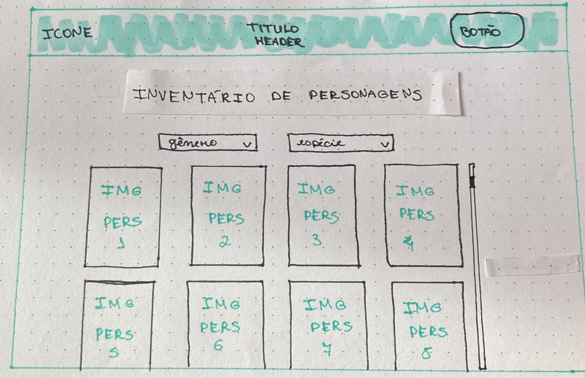
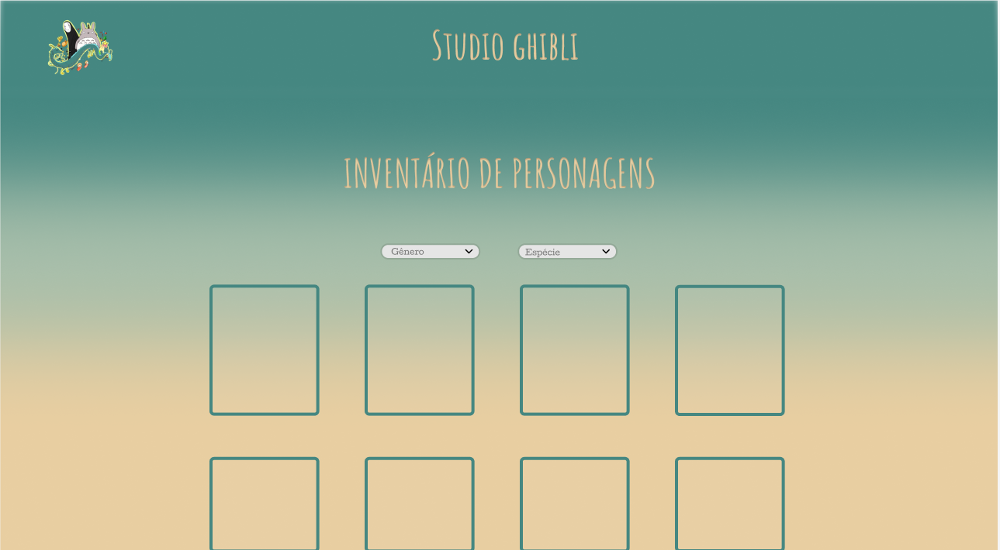
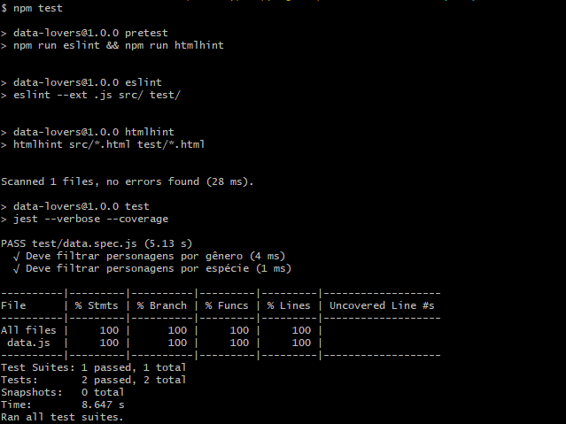

# 💖 Inventário de personagens do Studio Ghibli 💟

## Índice 🧵

* [1. Resumo do projeto 📑](#1-resumo-do-projeto📑)
* [2. Processo de desenvolvimento e funcionalidades➰](#2-processo-de-desenvolvimento-e-funcionalidades➰)
* [3. Histórias de usuários 📜](#4-histórias-de-usuários📜)
* [4. Prototipos 🤖](#5-prototipos 🤖)
* [5. Apresentando a interface 🖥️](#5-apresentando-a-interface🖥️)
* [6. Testes Unitários ⚠️](#6-testes-unitários⚠️)
* [7. Checklist ✅](#7-checklist✅)

***

## 1. Resumo do projeto 📑

Este projeto tem como propósito desenvolver uma página web que apresente um inventário de personagens de todos os filmes do Studio Ghibli, exibidos em cards que permitem ao usuário filtrá-los por gênero ou espécie. O principal objetivo é aprender a desenhar e construir uma interface web que seja intuitiva e eficiente para visualizar e manipular dados, visando atender às necessidades do usuário de forma clara e objetiva.

## 2. Processo de desenvolvimento e funcionalidades ➰

Durante o processo de desenvolvimento deste projeto, foram utilizadas as tecnologias HTML, CSS, JavaScript, Git e GitHub. A primeira etapa consistiu na criação de protótipos de baixa e alta fidelidade, para definir a aparência e a funcionalidade da página. E por último, foram realizados testes unitários para garantir a eficácia da interface.

As principais funcionalidades da página incluem a exibição dos dados em cards, além disso é possível filtrar os personagens por gênero ou espécie, para facilitar a busca por personagens específicos. A página é responsiva e se adapta a diferentes tamanhos de tela. A interface segue os fundamentos do visual design, proporcionando uma experiência agradável e intuitiva ao usuário. Também foram escritos testes unitários para garantir a funcionalidade das funções responsáveis por filtrar os dados.

## 3. Histórias de usuários 📜

História de usuário 1: 
Como um fã do Studio Ghibli, eu quero poder pesquisar e visualizar todos os personagens dos filmes do Studio Ghibli em uma página de inventário que possa ser filtrada por espécie ou gênero, para que eu possa rapidamente encontrar informações específicas sobre um personagem ou grupo de personagens. Além disso, eu gostaria de poder ver imagens de cada personagem, para que eu possa facilmente identificá-los e me lembrar de suas características. Isso me permitiria mergulhar mais profundamente na mitologia e história dos filmes do Studio Ghibli e criar conexões entre os personagens em diferentes filmes.

História de usuário 2:
Como um fã ávido do Studio Ghibli, eu quero poder categorizar os personagens por espécie ou gênero em uma página de inventário para poder ver rapidamente todos os personagens de uma determinada espécie ou gênero em todos os filmes do estúdio. Por exemplo, se eu quiser ver todos os personagens femininos dos filmes do Studio Ghibli, eu posso filtrar por gênero e ver todos eles em uma única lista com imagens, o que me ajudará a entender melhor a representação de gênero nos filmes do Studio Ghibli.

## 4. Protótipos 🤖

A etapa de prototipagem foi fundamental para o desenvolvimento da página de inventário de personagens do Studio Ghibli. Foram criados protótipos de baixa e alta fidelidade para explorar diferentes possibilidades de layout e funcionalidades. Com os protótipos em mãos, foi possível definir a aparência e a experiência de uso da página de forma mais clara e eficiente. A partir dos testes realizados com os protótipos, foram feitas as escolhas finais para a criação da interface final da página.
   ## Protótipo de baixa fidelidade:
 

   ## Protótipo de alta fidelidade: 

## 5. Apresentando a interface 🖥️

A interface do inventário de personagens do Studio Ghibli é simples e intuitiva, proporcionando uma experiência agradável ao usuário. Ao acessar a página, o usuário é recebido com uma lista de cards, cada um representando um personagem diferente dos filmes do estúdio. Cada card contém uma imagem do personagem.

O usuário tem a opção de filtrar os personagens por gênero ou espécie, para facilitar a busca por personagens específicos. Os filtros podem ser encontrados abaixo do título da página.

Para usar os filtros, basta clicar em um dos botões correspondentes. Ao clicar no botão "Gênero", uma lista será exibida, permitindo que o usuário escolha entre "Masculino" ou "Feminino". Ao clicar no botão "Espécie", o usuário poderá escolher entre diferentes espécies já vistas nos filmes do estúdio.

Além disso, a página é responsiva e se adapta a diferentes tamanhos de tela, proporcionando uma experiência consistente em todos os dispositivos. Para garantir a eficácia da interface, foram realizados testes de usabilidade durante o processo de desenvolvimento.
 
Para visualizar a página, basta acessar a página do GitHub Pages, ou através do comando NPM START no seu terminal após fazer o clone do repositório em sua máquina. Em seguida, é possível usar os filtros para encontrar personagens específicos, a página é atualizada automaticamente com os resultados do filtro.

## 6. Testes unitários ⚠️

Nesse projeto aprendi a como escrever meus próprios testes nas funções de fliltragem da página.

## 7. Checklist ✅

* [✔️] Usar VanillaJS.
* [✔️] Passa pelo linter (`npm run pretest`)
* [✔️] Passa pelos testes (`npm test`)
* [✔️] Testes unitários cobrem um mínimo de 70% de statements, functions, lines e
  branches.
* [✔️] Inclui uma _definição de produto_ clara e informativa no `README.md`.
* [✔️] Inclui histórias de usuário no `README.md`.
* [✔️] Inclui rascunho da solução (protótipo de baixa fidelidade) no `README.md`.
* [✔️] UI: Mostra lista/tabela/etc com dados e/ou indicadores.
* [✔️] UI: Permite filtrar dados com base em uma condição.
* [✔️] UI: É _responsivo_.
