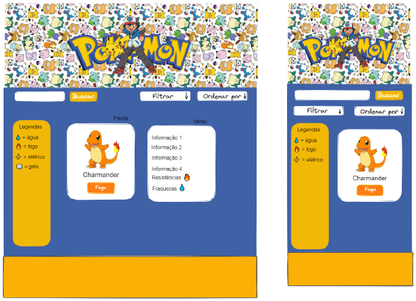

# Data Lovers

## Índice

- [Data Lovers](#data-lovers)
  - [Índice](#índice)
  - [1. Preâmbulo](#1-preâmbulo)
  - [2. Resumo do projeto](#2-resumo-do-projeto)
  - [3. Definição de produto](#3-definição-de-produto)
    - [Histórias de usuário](#histórias-de-usuário)
    - [Desenho de interface do usuário](#desenho-de-interface-do-usuário)
      - [Protótipo de alta fidelidade](#protótipo-de-alta-fidelidade)
  - [4. Checklist dos objetivos de aprendizagem alcançados](#4-checklist-dos-objetivos-de-aprendizagem-alcançados)

***

## 1. Preâmbulo

Segundo a [Forbes](https://www.forbes.com/sites/bernardmarr/2018/05/21/how-much-data-do-we-create-every-day-the-mind-blowing-stats-everyone-should-read)
90% dos dados que existem hoje foram gerados durante os últimos dois anos. A
cada dia geramos 2.5 milhões de terabytes de dados, uma cifra sem precedentes.

Apesar disso, os dados por si só são de pouca utilidade. Para que essas grandes
quantidades de dados se convertam em **informação** compreensível para os
usuários, precisamos entender e processar estes dados. Uma forma simples de
fazer isso é criando _interfaces_ e _visualizações_.

## 2. Resumo do projeto

Neste projeto foi **construido uma _página web_ para visualizar um _conjunto
(set) de dados_** que se adequa às necessidades de seu usuário.

Trata-se de uma página web que permite **visualizar dados,
filtrá-los, ordená-los e fazer algum cálculo agregado**. 

O objetivo principal deste projeto foi aprender a desenhar e construir uma
interface web onde se possa visualizar e manipular dados, entendendo o que o
usuário necessita.

## 3. Definição de produto

O projeto foi construido para fãs de Pokémon, tanto de jogos como do desenho, que quer ter mais informações sobre o personagem, e também para jogadores de Pokémon UNITE que querem saber as resistências, fraquezas dos personagens, para conseguir escolher com mais precisão seu personagem para jogar.
Para auxiliar na busca, o projeto conta com a barra de pesquisa, o filtro, e a opção de ordenar. 

### Histórias de usuário
Pensando nos objetivos do usuário:
1: Vizualizar todos os pokémons e suas informações ao abrir a aplicação.
2: Ordernar todos os pokémons por ordem alfabética crescente e decrescente.
3: Filtrar os pokémons por tipo.
4: Buscar um pokémon pelo nome.

Ao entrar no site, o usuário visualizará todos os Pokemóns, e ao passar o mouse por cima do card com a imagem, terá as informações de: peso, altura, candies, raridade, resistência e fraquezas. Há uma opção para ordenar os Pokemóns por ordem Alfabética, um filtro para que seja possível filtrar o tipo do personagem e um campo para a busca especifica pelo nome.  

O site foi pensando para ser utilizado quando fãs do desenho quiserem ter mais informações do personagem, ou, quando jogadores de Pokémon quiserem saber as características dos personagens para escolher de acordo com seu objetivo no jogo (atacar, defender, dar assistência);

### Desenho de interface do usuário

 Protótipo de baixa fidelidade

#### Protótipo de alta fidelidade

Protótipo para Desktop

Protótipo para Mobile 

Paleta de cores utilizada

## 4. Checklist dos objetivos de aprendizagem alcançados

* [✓] Usar VanillaJS.
* [✓] Passa pelo linter (`npm run pretest`)
* [✓] Passa pelos testes (`npm test`)
* [✓] Testes unitários cobrem um mínimo de 70% de statements, functions, lines e
  branches.
* [✓] Inclui uma _definição de produto_ clara e informativa no `README.md`.
* [✓] Inclui histórias de usuário no `README.md`.
* [✓] Inclui rascunho da solução (protótipo de baixa fidelidade) no `README.md`.
* [✓] Inclui uma lista de problemas detectados nos testes de usabilidade no
  `README.md`.
* [✓] UI: Mostra lista/tabela/etc com dados e/ou indicadores.
* [✓] UI: Permite ordenar dados por um ou mais campos (asc e desc).
* [✓] UI: Permite filtrar dados com base em uma condição.
* [✓] UI: É _responsivo_.
